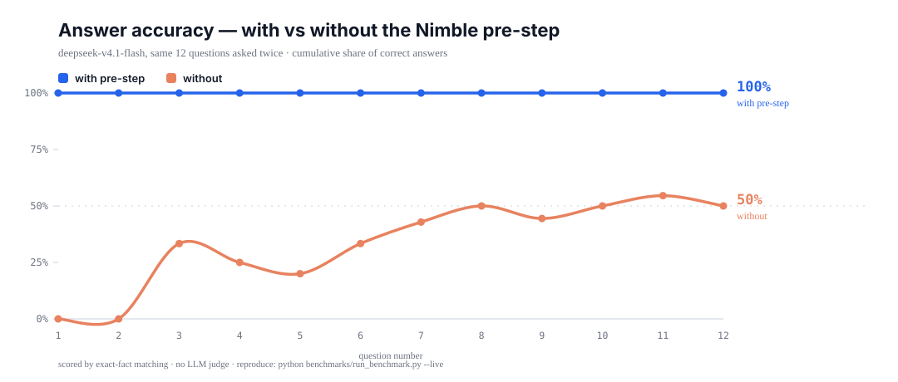

<div align="center">

# Nimble9B-skills

**Give your AI agent a fast little brain that reads the question before it does.**

A decision pre-step for [Hermes Agent](https://github.com/NousResearch/hermes-agent), powered by
[Nimble](https://ollama.com/library/nimble) — a 9B classifier that makes a call in **~80ms**
on your own machine.

[What it does](#what-it-does) · [Why you want it](#why-you-want-it) · [Install](#install) · [Benchmark](#benchmark) · [Requirements](#requirements)

</div>

---

## What it does

You know that thing where you ask an AI assistant a question and it spends the first
sentence figuring out what you meant? This fixes that.

Before your message reaches the AI, a small model reads it and answers three quick
questions: *what area is this about? does it need live data? is it underspecified?*
Then it hands your AI a note — and if it recognises the area, it hands over **real facts**
instead of a label:

```
[nimble pre-step] Local classifier — a probabilistic guess, not a reasoner.
domain=aurora (0.98) | live-data-needed=no
ground truth — aurora lives at ~/code/aurora. Run it with `make serve` ->
http://localhost:8080; tests with `make test`; dev database `aurora_dev`;
production deploys from the `release` branch only.
```

That's it. That's the trick. The AI no longer has to ask you where your project lives,
guess your port number, or invent a plausible-sounding branch name.

The same small model also stands in front of **risky actions**. If you (or the AI) are about
to run something that deletes data, it raises its hand first:

```
BLOCKED: Nimble flagged terminal as potentially harmful (harm=0.99). Confirm before running.
```

---

## Why you want it

**It's cheap.** Once the model is loaded it answers in about **80 milliseconds**. You will
not notice it. A single avoided "sorry, which project do you mean?" costs you far more than
that.

**It runs on your machine.** Your prompts do not go to a third party to be classified. It's
9.5GB of local model, Apache-2.0 licensed, and it works offline.

**It's the difference between "I think" and "I know".** Most AI tooling makes your assistant
more talkative. This makes it more *correct*, by handing it facts that were previously
guesses.

**You decide.** It stays off until you switch it on. Say `boot up the nimble skill` and it's
live for that session; say `deload` and it's gone. Restart the app and it's off again — there
is no permanent tax on your setup.

> **Honest limits.** Nimble is a *classifier*, not a genius. It picks one answer from a list
> you give it and cannot explain itself. It's about 83% accurate at routing in our tests and
> roughly 81% on published safety tasks. Treat the routing note as a well-informed hint, and
> the safety gate as a second opinion — never as the only thing standing between you and an
> irreversible command. We'd rather tell you this than have you find out the hard way.

---

## How it works

```
your message
     │
     ▼
┌──────────────────┐   one call, ~80-700ms, all local
│ nimble (9B)      │   "which area? needs live data? underspecified?"
└──────────────────┘
     │
     ├──► a note is attached to your message, with real paths/hosts if the area is known
     │
     ▼
┌──────────────────┐
│ your agent       │   any model: GPT, Claude, DeepSeek, a local LLM...
└──────────────────┘
```

Nimble is **not** answering your question and never sees the conversation. It reads only
your current message, returns a small structured answer, and gets out of the way.

It's wired into Hermes through its plugin system, using two lifecycle hooks:

| Hook | When it fires | What it does |
|---|---|---|
| `pre_llm_call` | before each of your messages reaches the model | routes it, injects the note |
| `pre_tool_call` | before a tool actually runs | escalates anything harmful to you |

Read the detail in [`docs/how-it-works.md`](docs/how-it-works.md).

---

## Install

### 1. Get Ollama and the model

You need **Ollama 0.35 or newer** — decision models (`/v1/systemone`) are a recent addition
and older builds will not have the endpoint.

```bash
# check your version first
ollama --version          # must be >= 0.35

ollama pull nimble        # ~9.5 GB, once
```

No Ollama? Get it at [ollama.com/download](https://ollama.com/download).

> **Hardware note.** `nimble:latest` is 9.5GB. If it doesn't fit on your GPU, Ollama will
> still run it on CPU — you'll just trade the ~80ms for a few seconds. A smaller quantised
> build works too; point the plugin at it with the `model` setting.

### 2. Install the plugin

```bash
# clone this repo
git clone https://github.com/nanachi2002/Nimble9B-skills.git
cd Nimble9B-skills

# copy the plugin into your Hermes profile
cp -r plugins/nimble-steering ~/.hermes/plugins/

# and the skill that teaches the agent how to use it
cp -r skills/nimble-decision-model ~/.hermes/skills/
```

On Windows, `~/.hermes` is `C:\Users\<you>\AppData\Local\hermes`.

### 3. Turn it on

```bash
hermes plugins enable nimble-steering
```

Then start a new session and:

```
/nimble status      # check it can see your model
/nimble boot        # arm it for this session
```

That's it. Talk normally.

> The plugin does **not** install anything on its own, opens no network ports, and stores no
> state on disk. It talks to Ollama on `127.0.0.1` and nothing else.

---

## Use it

### The two commands you actually need

| Command | What it does |
|---|---|
| `/nimble boot` | arm the pre-step for this session |
| `/nimble deload` | disarm it |

You can also just say it in plain English — "boot up the nimble skill" — and the agent will
arm it for you.

### Make it know *your* projects

Out of the box the plugin knows a demo project called `aurora`, so you can see it work
before configuring anything. Then open the plugin file and edit `DOMAIN_HINTS`:

```python
DOMAIN_HINTS = {
    "myapp": ("myapp lives at ~/code/myapp. Run it with `make dev` -> http://localhost:3000; "
              "tests with `pytest`; staging at 10.0.0.5; deploy from the `release` branch."),
}
```

Add the matching entry to `ROUTE_QUESTIONS["domain"]["criteria"]` so the classifier can
actually pick it, and it's in.

**This is where the value is.** A label like `domain=myapp` is easy for a model to ignore.
`myapp lives at ~/code/myapp, staging at 10.0.0.5` is not.

### Tune the safety gate

```yaml
# config.yaml
plugins:
  entries:
    nimble-steering:
      settings:
        harm_threshold: 0.7    # 0.0-1.0; set to 0 to disable the gate entirely
        keep_alive: 30m        # how long the model stays in RAM
        model: nimble
        base_url: http://127.0.0.1:11434
```

Read-only tools (`read_file`, `web_search`, …) skip the gate completely — they can't damage
anything, so there's no reason to spend a call on them.

---

## Benchmark

We measure whether having a cheap classifier pre-read the question actually helps the model
answering it. Same questions, same model, twice — once with the note, once without.

```bash
python benchmarks/run_benchmark.py            # offline: routing quality + overhead
python benchmarks/run_benchmark.py --live \
    --model deepseek-v4.1-flash \
    --base-url https://ollama.com/v1 \
    --api-key-env OLLAMA_API_KEY              # score a real model end to end
```

**Classifier routing accuracy: 10/12 (83.3%)** — against Nimble's published 86.9% on
MASSIVE-en-US intent routing. The two misses are instructive rather than embarrassing:

| Case | Expected | Got | Reading |
|---|---|---|---|
| "What is the latest stable Python release?" | `web` | `code` | Live-data questions get read as programming. Harmless — the note still flags "live data needed". |
| "it's broken again, fix it" | `none` | `hermes` | A genuinely ambiguous message gets a confident-sounding label. **This is why the note tells the agent to ignore it if it looks wrong.** |

**Classifier overhead: ~596ms median** for the full routing question set on a consumer GPU,
~80ms for the single-question gate call. Latency tracks the *number* of questions, not their
length — which is why the safety gate asks one question, not three.

### End-to-end: does the note actually help?

The same 12 questions, put to `deepseek-v4.1-flash` twice — once with the note, once without.
Everything is scored against fixed expected facts, so it can't be argued with.

| | **WITH pre-step** | **WITHOUT** |
|---|---:|---:|
| **Answered correctly** | **100%** | **50%** |
| Median response time | **947ms** | 7,615ms |
| Had to ask for clarification | 2 | 8 |



**The interesting part is not the ones it got right — it's the ones it got wrong, and how.**

Asked *"What port does aurora listen on locally?"* with no note, the model did not say "I don't
know". It confidently answered about two entirely different projects:

> *"Apache Aurora's scheduler listens locally on **port 8081** by default... If you meant
> **Amazon Aurora**, the default port depends on the engine: Aurora MySQL `3306`, Aurora
> PostgreSQL `5432`..."*

Asked how to run the tests, it invented `./gradlew test`. Asked where the staging database
lives, it explained it couldn't access your infrastructure — then speculated anyway.

With the note, all three are answered from the fact line, in under a second.

> **This is the honest sales pitch.** The pre-step doesn't make your model smarter. It removes
> the opportunity for it to invent things it was never told. A model that doesn't know your
> port number will guess, and it will sound certain while doing it.

**Control cases confirm it isn't just adding tokens.** On questions where no ground truth
applies ("explain how a hash map handles collisions", "hey, good morning"), both arms scored
identically — the note adds nothing there, and doesn't need to.

**Caveat on the latency numbers.** They are a median over 12 cases and the variance is high —
individual calls ranged from 0.6s to 34s on both arms. The accuracy and clarification counts
are the stable measurements; treat the timing as directional. Everything is reproducible with
the commands below.

### Reproduce it yourself

The numbers above are not a claim, they're a command. Everything is local and free except
the optional `--live` mode, which scores whatever model you already pay for.

---

## Requirements

| | |
|---|---|
| **Ollama** | 0.35 or newer — the `/v1/systemone` endpoint is new |
| **Model** | `ollama pull nimble` (~9.5GB) |
| **RAM/VRAM** | ~10GB for comfortable GPU use; CPU works but slower |
| **Hermes** | a build with the plugin + middleware system |
| **Network** | none — the plugin only talks to `127.0.0.1` |

---

## Repository layout

```
plugins/nimble-steering/     the Hermes plugin (install this)
  __init__.py                classifier wiring, hooks, tool, /nimble command
  plugin.yaml                manifest
skills/nimble-decision-model/ how to use Nimble well (and its traps)
benchmarks/
  run_benchmark.py           with/without harness
  cases/routing_cases.json   the questions
  results/                   generated output
docs/
  how-it-works.md            the lifecycle hooks in detail
  tuning.md                  thresholds, hints, troubleshooting
```

---

## Contributing

Useful things to send:

- **Benchmark cases** — especially ones that break the classifier. A case we fail is worth
  more than one we pass.
- **Your `DOMAIN_HINTS` pattern** if you found a shape that works well for a particular kind
  of project.
- **Bug reports** with the `/nimble test` output attached.

Please keep the benchmark honest: if a change makes routing faster but worse, say so.

---

## Licence

MIT for this repository. Nimble itself is Apache-2.0, by
[Bespoke Labs](https://github.com/bespokelabsai/nimble). Not affiliated with them — just a
plugin that puts their model to work.
